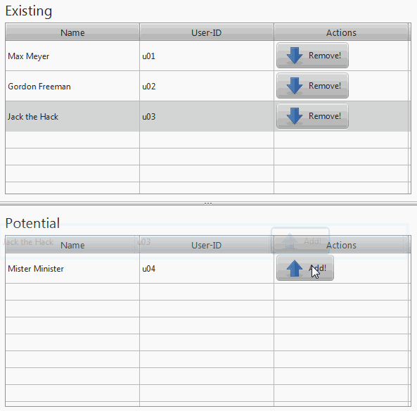

Table-to-table-transition in JavaFX
======================================

This small project implements a transition of table items between two tables in JavaFX. The use case for this component is to move items from one set of items to another, for example to give permissions to users of an application.

In this version, the tables have to have the same coordinates on the y-axis. However it should be fairly simple to modify this code.